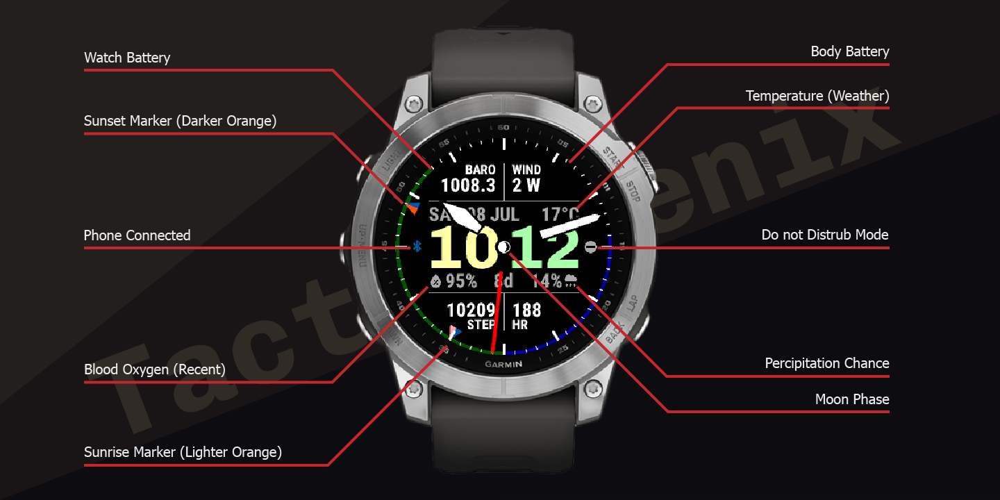

# Tactix-Fenix

Tactix and TactixFace inspired watch face for the Fenix 7. Element placement are calculated by pixels so it's only tested to work with 260x260 screens.

- Use Complications API to retrieve data for efficiency
- Tap and Hold to toggle Analog watch hands
- Sunrise and Sunset time display does not depend on GPS location, instead uses Weather location
- Moon phase calculated on device
